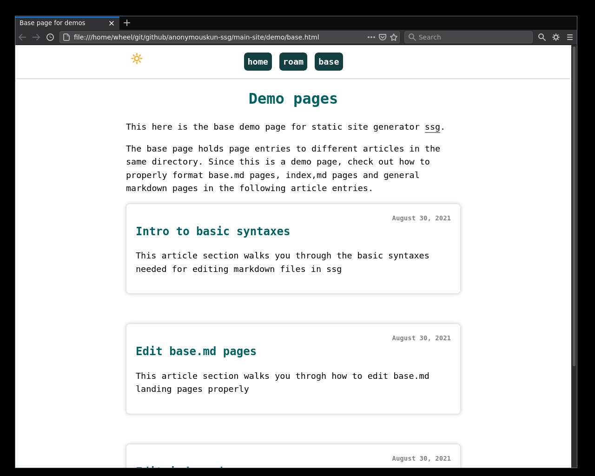
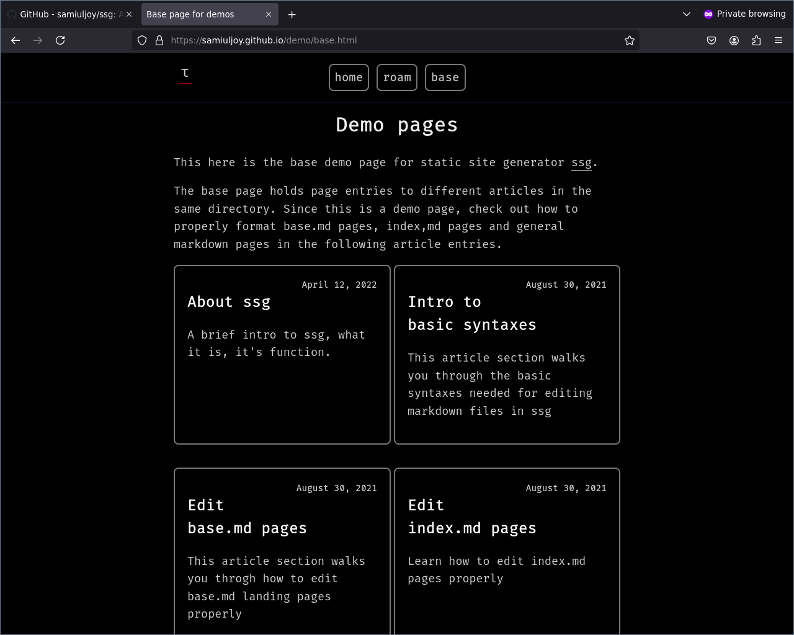

# ⚠ Update, December 2024: Account Migration to [github.com/samiulahmedjoy](https://github.com/samiulahmedjoy)

# Here's a Video tutorial

[](https://www.youtube.com/watch?v=W9qleSpFd20)

# Static Site Generator in Shell Script





## See site made with ssg -> [https://samiuljoy.github.io](https://samiuljoy.github.io)

## Intro

A static site generator written in shell script. Write posts in markdown.md format with added features like basic tables and underlines.

This is a minimalist site generator written from scratch. I've seen couple of git repos on static site generator being minimalist, where they pull bunch of dependencies, depends on third party libraries and what not.

This is nothing like that. The only dependencies are Gnu versions of `grep`, `sed`, `awk` and `xargs` which are probably already installed in your system if you're on Gnu/Linux. If not, then you'll need gnu-coreutils.

## Stuff in this repo

main.sh -> the main script file

rss.awk -> awk script to arrange rss.xml feed by latest dates (this is in a separate file because -> taken from stack exchange)

css directory -> has css styles

js directory -> has 28 lines of js code for dark mode and light mode toggle

demo -> a directory with some examples


## Walk through

* Get the repo

```
$ git clone https://github.com/samiuljoy/ssg.git
```

* Write the index.md by hand following [this](https://samiuljoy.github.io/demo/indexpage.html) article

* Generating a config.txt file

Move to ssg directory that you just clonned, then run;

```
$ sh main.sh config
```

This should generate a pre-made config file. The region between +++sitemap and ---sitemap is where you include your markdown files and directories. The sitemap section with your files should look something like this(it will be blank at first with nothing inside ++sitemap --sitemap region, you'll add items yourself like this);

```
++++++++++sitemap
index.md
about.md
contact.md
blog/base.md
blog/article1.md
physics/base.md
physics/quantum.md
math/base.md
math/integrations.md
--------sitemap
```

**Note: the amount of +++ or ---- does not matter as long as it's more than 2 ^_^**

Add files and directories as you wish, but the first file of every directory should be a base.md file, see above in the sitemap region, blog/base.md, physics/base.md, math/base.md, they all have base.md as the first file, because it's the landing page where you mention your sub-articles for that directory. More on that later on.

* Adding pages to navigation section

Now, after running `sh main.sh config` and adding files and directories in the sitemap section of config.txt, run;


```
$ sh main.sh navgen
```

This will generate a navigation section in config.txt based on the files and directories you entered within the sitemap section. Or you could manually enter them in the navigation section with base pages like this;

```
+++++++++navigation
.homepage: [home](index.html)
.navmenu: roam
.navpage: [blog](blog/base.html)
.navpage: [physics](physics/base.html)
.navpage: [math](math/base.html)
.backpage: [base](base.html)
--------navigation
```

**note: The .navpage: section is what you'll be adding if editing manually**

The text in square brackets [text] is what is shown in webpages, and text between parenthesis (link.html) is a html link. This is similar to how you define urls in markdown files.

* Then run init to initialize all files

```
$ sh main.sh init
```

This will initialize all files and directories based on files mentioned in sitemap section of config.txt

* Add your first post

To add your first post, run;

```
$ sh main.sh post
```

This will ask for some general info like;

```
Enter the title of the page: some title

Enter the author of the page[optional]: your name

Enter little bit of description about the page[optional]: some description about the article

Name of the file you're about to edit: math/integration.md

Provide a meta-name generator[optional]: the same name you put for the title or some short title

Provide a canonical link[optional]: https://yoursitelink.com/math/integration.html

Css portion: <-- just press enter or you can add a path/css.css for custom css

js portion: <-- just press enter or you can add a path/js.js for custom js

Use a footer or no?: press enter to use default --> this footer section gets called from footer section of config.txt

make file into a html?[y/n]: whether you want your file to get auto converted to html after you finish editing
```
**note: [optional] -> means you can skip it by hitting enter**

Then edit the post in proper format, see [https://samiuljoy.github.io/demo/syntax.html](https://samiuljoy.github.io/demo/syntax.html) for more details about writing posts properly.

Alternatively if you're editing a base.md file, see how to properly format a base.md file -> [https://samiuljoy.github.io/demo/basepage.html](https://samiuljoy.github.io/demo/basepage.html)

* Adding a post to a pre-formated $dir/base.md

Run;

```
$ sh main.sh add

dirname and filename.md to add [eg-> blog/blog.md]: blog/article1.md

Use [d]efault date or [c]ustom date [d/c]: enter d or c <-- the date entry for the article

Add a title: some title

-----[snip]------
```

This will auto add an article entry in the blog/base.md file and format it properly


* Remove the latest post you just entered

To remove the latest post you entered if you've added it through `sh main.sh add`, then run;

```
$ sh main.sh remove latest
```

Alternatively you can use a custom file name $dir/base.md like this;

```
$ sh main.sh remove last blog/base.md
```

It has to be a base.md file since article entries are called from base.md files.

* Convert a single markdown file to html

You can convert any file with filename.md to a html file. This inlcudes base.md files and also normal md files;

```
$ sh main.sh html blog/base.md
or
$ sh main.sh html about.md
```

This will generate a html file format for that $file.md

* Convert all markdown files to html format

Run;

```
$ sh main.sh all
```

This will convert all markdown files mentioned in the ++sitemap --sitemap region to be converted to filename.html

* Generate a rss for your site

Run;

```
$ sh main.sh rss
```

This will generate a rss feed based on latest entires on base.md files.

* Remove or add a directory entry

To add a directory entry to all files and also config.txt; do

```
$ sh main.sh adddir

Enter the name of the directory: testdir

Enter the name to be displayed on webpages: testdirectory

The name of the directory is testdir and the display name is testdirectory, is this correct? [y/n]: y
```

This will add directory entries to config files and also to all base.md files mentioned in config.txt. Then run;

```
$ sh main.sh all
```

To generate renewed version of the base files. Now, you can also remove directory entries the same way with rmdir;

```
$ sh main.sh rmdir
```

* Make clean site

Run;

```
$ sh main.sh final
```

This will generate a final clean site with all your html files in main-site directory.

* Here's what I'd do

First clone the git,

```
$ git clone https://github.com/samiuljoy/ssg.git
```

then cd to that ssg, then run;

```
$ sh main.sh config
```

then edit the ++sitemap and --sitemap region of the config.txt file to add my markdown files, then run navgen to generate navigation section

```
$ sh main.sh navgen
```

Then run init to initialize all files and directories

```
$ sh main.sh init
```

Then edit index.md file -> see here how to edit index.md file [https://samiuljoy.github.io/demo/indexpage.html](https://samiuljoy.github.io/demo/indexpage.html)

Then edit all base.md files -> see here how to edit base.md file [https://samiuljoy.github.io/demo/basepage.html](https://samiuljoy.github.io/demo/basepage.html)

Then run;

```
$ sh main.sh add
```

To add new posts to articles and generate article entries automatically.

When done creating all files, I'd do;

```
$ sh main.sh all
```

To generate html pages from all mardown pages

Then generate a rss;

```
$ sh main.sh rss
```

Then to clean everything up and make it a final site;

```
$ sh main.sh final
```

Now head over to main-site directory where your files are ready to be published

Done!

**Note: Images and medias should be in assets directory**

Visit [https://samiuljoy.github.io](https://samiuljoy.github.io) for detailed info.
