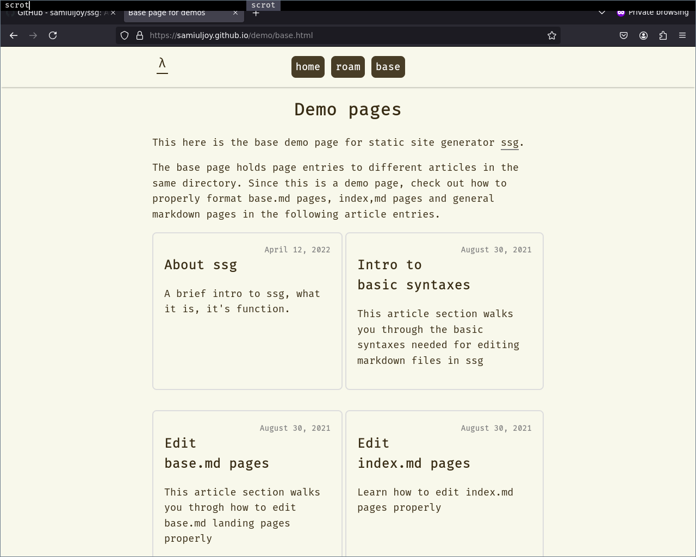

> [!IMPORTANT]
> ***New repositories from now on will be uploaded to [github.com/samiulahmedjoy](https://github.com/samiulahmedjoy) If you have any issues regarding this repository, make sure to open issues here instead at [github.com/samiulahmedjoy/ssg](https://github.com/samiulahmedjoy/ssg)***

# Here's a Video tutorial

# Static Site Generator in Shell Script

A Demo page

## See site made with ssg -> [https://samiuljoy.github.io](https://samiuljoy.github.io)

## Intro

A static site generator written in shell script. Write posts in markdown.md format with added features like basic tables and underlines.

This is a minimalist site generator written from scratch. I've seen couple of git repos on static site generator being minimalist, where they pull bunch of dependencies, depends on third party libraries and what not.

This is nothing like that. The only dependencies are Gnu versions of `grep`, `sed`, `awk` and `xargs` which are probably already installed in your system if you're on Gnu/Linux. If not, then you'll need gnu-coreutils.

## Stuff in this repo

main.sh -> the main script file

rss.awk -> awk script to arrange rss.xml feed by latest dates (this is in a separate file because -> taken from stack exchange)

css directory -> has css styles

js directory -> has 28 lines of js code for dark mode and light mode toggle

demo -> a directory with some examples

### This 9 steps are basically tldr; Watch the video above for demo

**Step1:** Generate a config file by running 'sh main.sh config'. Then edit the config.txt file on your own. For an example config file, you can see 'https://samiuljoy.github.io/config.txt'. Make sure to add a base.md page on your first entry to every new page except for about and index page. The need for base.md page is to hold records of the different posts and display them on a dedicated page. For more info about basepage syntax please refer to 'https://samiuljoy.github.io/demo/basepage.html'

**Step2:** If you're done editing config.txt file, initialize everything that you've declared on your config file by running 'sh main.sh init'. This will create all the files, directories and whatnot

**Step3:** Now, generate navigation section by running 'sh main.sh navgen'. This navigation part just adds home, roam and base buttons on your navigation section

**Step4:** Now generate an index file with 'sh main.sh indexgen'

**Step5:** Now Edit the base.md page if your article is going to be in a directory such as 'blog/firstblog.md'. In such case, first edit 'blog/base.md' page with your text editor. For an example see 'https://samiuljoy.github.io/microblog/base.md' and for syntax documentation, please refer to 'https://samiuljoy.github.io/demo/basepage.html'. Just run 'sh main.sh post' and when it asks for the filename, just add 'blog/base.md' as the filename

**Step6:** If you've completed everything above correctly, you can start writing your posts. You can either run 'sh main.sh post' and add manual entries to config.txt, blog/base.md file or you could just run 'sh main.sh add' and let all your entries by added automatically. It's your choice, depends on use case hence, added both post and add option for for variance.

**Step7:** Now since you've added all posts and everything, now run 'sh main.sh all'. This will generate html pages for all the files mentioned in 'config.txt'.

**Step8:** For convenience you can also run 'sh main.sh final' which will copy all the generated html files into a separate sub-directory

**Step9:** Last but not least, you can also generate rss.xml feeds of all your posts. Just run 'sh main.sh rss'"

Done!

**Note: Images and medias should be in assets directory**

Visit [https://samiuljoy.github.io/demo/base.html](https://samiuljoy.github.io/demo/base.html) for detailed info.
